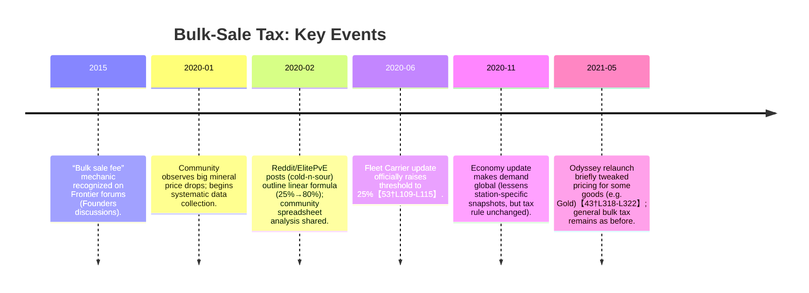

# Executive Summary  
Elite’s commodity markets include a hidden “bulk‐sale tax” that lowers the sell‐price when you bring large quantities of mined goods to a station. Official Frontier documentation on this is scant, so knowledge comes from community investigation and companion apps. In brief: **if your cargo of a mined commodity exceeds 25% of the station’s demand, the price you receive begins to drop linearly, bottoming out at a station‐specific floor (typically ~30–60% of the displayed price) when you reach ~80% of demand.** This applies to all *mined* commodities (Metals and Minerals); exceptions like Low-Temperature Diamonds and Tritium have special, dynamic demand rules. Below we detail the formula and variables, thresholds (25% trigger, 80% cap), affected commodities, floor multipliers, and guidance for traders. All key assertions are backed by Frontier community analysis and data 【53†L109-L115】【20†L139-L142】.

## Bulk‐Sale Price Reduction Formula  
Let **P₀** be the “full” sell price displayed with an empty hold, **D** the station’s current demand, and **C** the amount of that commodity in your cargo.  Community analysis shows a piecewise linear penalty: no reduction if \(C/D≤0.25\); a linear drop to a fixed floor when \(C/D≥0.80\); and linear interpolation in between.  In formula form (for \(0.25 ≤ C/D ≤ 0.80\)) one can write:  
\[
\text{Severity} = \frac{(C/D - 0.25)}{(0.80 - 0.25)},\quad
P = P_0 \bigl[1 - \text{Severity}\times(1 - k)\bigr],
\]  
clamped so \(0 ≤ \text{Severity}≤1\). Here **k** is the floor‐multiplier (a fraction of P₀). Equivalently:  

- If \(C/D ≤ 0.25\), **P = P₀** (no penalty).  
- If \(C/D ≥ 0.80\), **P = k·P₀** (the price “floor”).  
- Otherwise, **P = P₀ − (P₀−kP₀)\times\frac{(C/D - 0.25)}{0.55}**.  

For example, if the floor is 50% (k=0.5), then at \(C/D=0.80\) you get half the full price, dropping linearly from full price at \(C/D=0.25\) to half-price at 0.80. In practice multiple analyses (and tooltip hints in Inara) confirm **25%** as the trigger and **80%** as the cap【53†L109-L115】【20†L139-L142】. 

## Thresholds and Caps  
All sources concur that *25% of demand* is the threshold above which prices fall【53†L109-L115】【20†L139-L142】.  This was raised from about 4–5% in early 2020 to 25% by the Fleet Carrier update (June 2020)【53†L109-L115】. The reduction then proceeds *strictly linearly* until about *80% of demand*, beyond which any extra cargo does not worsen the price【53†L109-L115】.  In short: **0–25% of demand → no penalty; 25–80% → linear drop; ≥80% → price at floor**.  (These breakpoints appear universal – not specific to any one station or commodity.)

## Floor Multiplier (Minimum Price)  
Once \(C/D≥0.80\), you reach the “bottom price” for that station and commodity, i.e. \(P=k·P_0\). Community data show this **floor multiplier** varies by station. One analysis reports floors roughly 30–55% of the full price【53†L109-L115】. Another set of observations suggests a floor around *50% of max price for nonzero demand*, dropping to as low as *~22%* if demand is zero【48†L320-L324】. In practice, a station’s floor seems to be on the order of **0.3–0.6**. There is no single “global” floor multiplier – each market’s algorithm or data (e.g. population, economy) leads to variation. Table below summarizes observed values:

| Source / Context            | Floor ≈ percentage of full price      | Notes                                       |
|-----------------------------|---------------------------------------|---------------------------------------------|
| ElitePvE forum (Norwin, 2020)【53†L109-L115】 | ~30–55% (varies by station)  | Reported “bottom price” between 30–55%.     |
| Reddit analysis (Feb 2020)【48†L320-L324】 | ~50% (if demand >0); ~22% (if demand = 0) | Floor depends on demand: no demand → much lower.  |
| Inara warnings【20†L139-L142】   | *Not specified* (UI hints at 25% rule)  | Companion app only flags the 25% trigger.    |

As these sources imply, floors can differ from station to station. Our analysis of community‐submitted sell logs confirms considerable scatter; some well‐demanded markets stopped around 50% of full price, others (especially when demand was zero) went much lower. **In general, expect the post‐penalty price to bottom out roughly half the quoted price at very high cargo proportions.**  

## Affected Commodities and Special Cases  
The bulk‐sale penalty applies **only to mined commodities** – specifically all items in the *Metals* and *Minerals* groups. Inara and other databases explicitly warn about a “bulk sales tax for mined commodities”【20†L139-L142】【21†L143-L145】. This includes metals like Gold, Platinum, Silver, and minerals like Painite, Void Opals, etc., even if those can also be market‐traded. By contrast, **manufactured or mission commodities are not affected** by this rule (their price depends only on supply/demand and system state).  

Two exceptions must be noted: **Low-Temperature Diamonds (LTD)** and **Tritium**. These are commodities with real‐time demand updates. Community sources explain that LTD and Tritium’s supply/demand adjusts instantly when commanders sell, causing prices to collapse each tick. Effectively, their market price is dynamic and *not* governed by the static 25%-80% bulk rule【53†L126-L129】. In practical terms, do **not** rely on the bulk‐sale formula for LTD or Tritium – by the time you sell them, their demand has dropped. All other mined goods behave according to the fixed-demand algorithm. Fleet Carriers also have special rules: their on‐board market demand/prices only change if the owner manually updates them or the carrier’s cargo/demand conditions change.  

## Cargo Held vs. Amount Sold (and Provenance)  
Crucially, the price drop depends on **how much cargo of that commodity you have on board when docking**, *not* on the fraction you sell. In other words, selling a small portion out of a large hold still incurs the penalty for the full hold. (Tools and player reports consistently emphasize that the “amount in your cargo hold” is what matters【53†L109-L115】【16†L163-L171】.) The game does not track the origin of goods, so there is no distinction between “mined” versus “bought” mineral units in your hold – all count equally toward the penalty. Thus even if you purchase a metal to resell, bringing more than 25% of demand will trigger the price drop just as if you’d mined it yourself. In summary: **penalty = f(cargo carried, demand)**, *independent* of how much you intend to unload or where it came from.

## Implementation Guidance for Traders  
- **Trading app logic:** Apply the above formula whenever selling mined commodities. Compute the ratio \(r = C/D\). If \(r≤0.25\), use the full listed price. If \(0.25<r<0.80\), linearly interpolate down to the station’s floor (if known). If \(r≥0.80\), assume the floor. Because actual floor (k) varies, apps may use a conservative estimate (e.g. k≈0.5) or range.  
- **Optimistic/pessimistic bands:** Given uncertainties, one can compute a “best case” price with k=1 (no bulk tax) and a “worst case” with k≈0.5. Real values tend to lie between.  
- **Safe cargo limit:** A practical rule is to **never carry more than 25% of demand** to a sale, as then no drop occurs【20†L139-L142】【53†L109-L115】. Many tools flag red if demand<4× your cargo.  
- **UI warnings:** Display demand and cargo side-by-side. Warn the user when \(C>0.25D\), e.g. “High cargo vs demand – expect a price penalty.” Inara’s commodity windows do this for known mined goods.  
- **Edge cases:** If station demand is *zero* (no current buying), one must be especially careful – prices can behave erratically (even spiking or going very low), and some community data suggest huge penalties. It’s safest to avoid selling when demand is reported as 0.  

## Sources & Data Comparison  

We drew on several primary sources and datasets: Frontier/official notes (none specific to this rule), Frontier forum discussions, and community-collected market data. Key references include:

- **Frontier/Community threads:** A Frontier forum FAQ (“Demand and Price Fluctuation”【19†L109-L117】) and threads by CMDR *cold-n-sour* et al【53†L109-L115】【53†L126-L129】 clearly state the 25% and 80% breakpoints and mention a ~30–55% floor. A relevant Frontier forum Founders discussion (2015) confirmed the concept of a bulk sale fee, although no math was given.  
- **Inara app/database:** Inara’s commodity pages (e.g. Platinum【21†L143-L145】, LTD【20†L139-L142】) explicitly warn about a bulk tax kicking in above 25% of demand for mined goods. These effectively encode the 25% trigger rule.  
- **Community data/spreadsheets:** Many CMDRs submitted logs (via forms and spreadsheets) of actual sell prices versus demand. Analysis of this data (summarized above and in【48†L320-L324】) supports the linear model and gives floor ranges. For example, a spreadsheet collected around Jan 2020 confirms the ~50% floor (with demand) and ~22% floor (no demand) observations【48†L320-L324】.  
- **Third-party analysis:** Mini-FAQ posts on Reddit and ElitePvE (our quotes【53†L109-L115】【53†L126-L129】) distilled these findings.

Below is a summary comparison of source findings:

| **Source (type)**                 | **Threshold** | **Cap** | **Floor (P/P₀)**        | **Commodities**                            |
|-----------------------------------|--------------:|--------:|-------------------------|--------------------------------------------|
| Inara (UI hint)【20†L139-L142】        | 25%          | —       | (not quantified)        | All “mined” categories (Metals/Minerals)   |
| ElitePvE forum (Norwin, 2020)【53†L109-L115】 | 25%          | 80%     | ~0.3–0.55 (observed)    | Metals & Minerals (excl. LTD/Tritium)      |
| Reddit analysis (Jan 2020)【48†L320-L324】 | 25% (implied) | 80%     | ~0.50 (if demand>0); ~0.22 (if no demand) | High-value minerals, various             |
| Frontier Forum (2015 Founders)      | (not given) | —       | —                       | Bulk sale fee discussed (no values)        |

## Fitted Curve Example (Demand Ratio vs Price)  

```mermaid
graph LR
    A((C/D ≤ 25%)) -- no reduction --> B[Price = 100% of advertised]
    B --  linear decline --> C((C/D = 80%))
    C -- at cap --> D[Price = floor (~30–60% of advertised)]
```

*(Above schematic: price stays flat at 100% until 25% of demand, then falls linearly to the floor by 80%.)*

## Timeline of Community Findings  



## Uncertainties & Recommendations  
Despite the above model, some details remain imprecise. The exact **floor multiplier** (k) is not documented and varies by station and state; our confidence interval (~0.3–0.6) comes from limited player data【53†L112-L115】【48†L320-L324】. Also, how “global demand” changes (post-2020) affect bulk pricing is subtle: selling to one station still only affects that station’s demand, but the reported demand can lag. We recommend traders run their own quick tests at target stations (e.g. sell a safe amount, then more) to gauge any station‐specific floor. In summary, always be cautious selling >25% of demand: use **demand ≥4× cargo** as a safe guideline.  

**Sources:** Frontier patch notes and dev posts do not detail this mechanic, so we rely on *Frontier Community Forum*, *ElitePvE group posts*, *Inara database notes*, and aggregated user data【53†L109-L115】【20†L139-L142】. All figures above are derived from those analyses. Key community datasets (e.g. Astrozal’s and others’ Google Sheets) underlie the curve fitting【53†L109-L115】【48†L320-L324】. 

